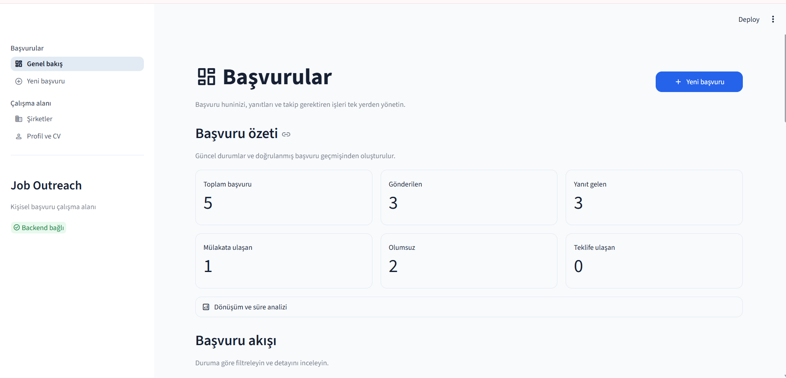
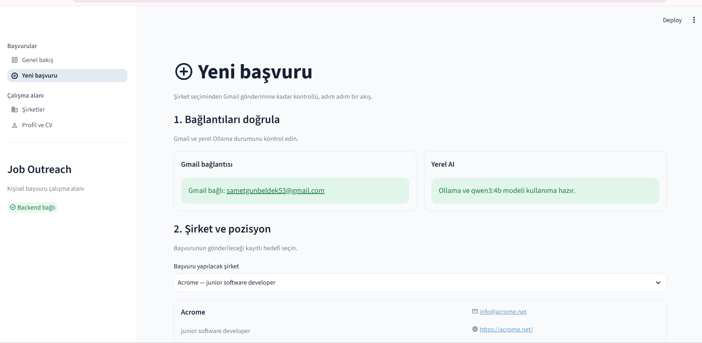
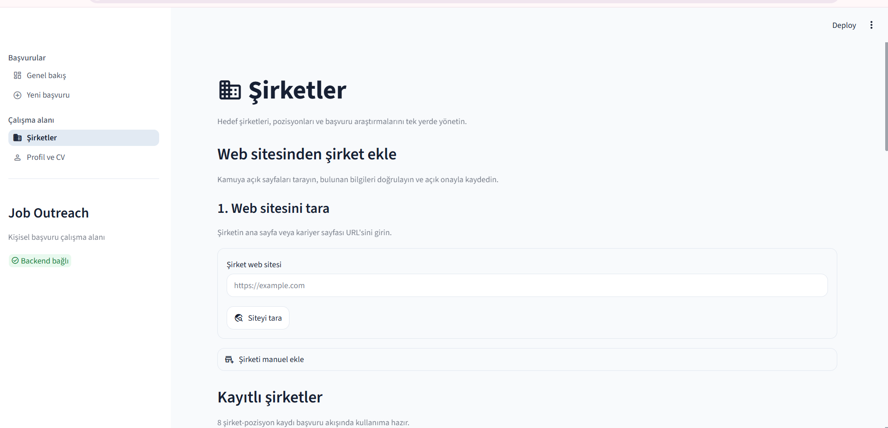
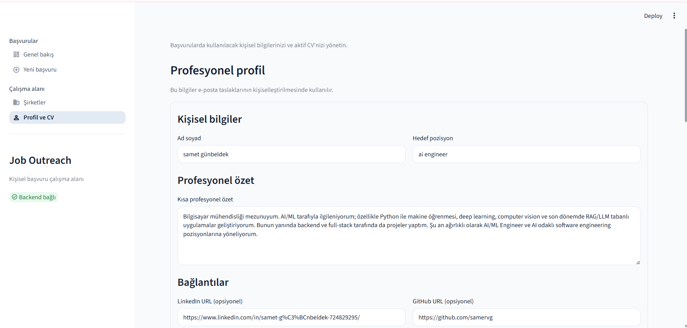
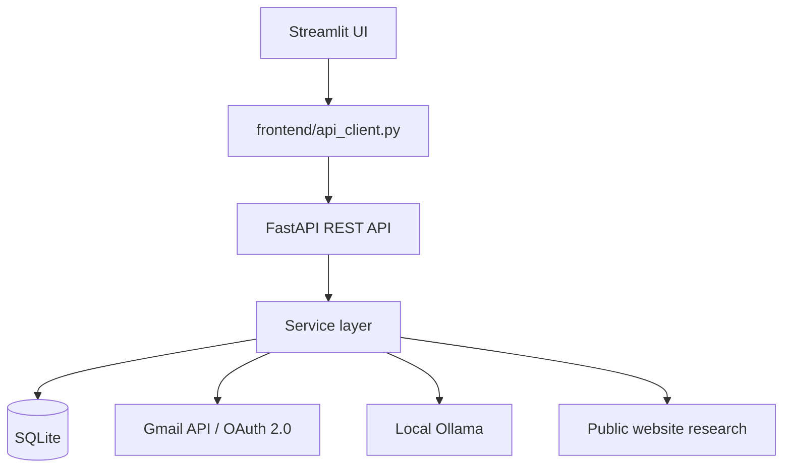

# Job Outreach Assistant

İş başvurularında şirket araştırması, kişiselleştirilmiş e-posta hazırlama,
gönderim ve başvuru takibini tek yerde toplamak için geliştirdiğim yerel bir
uygulama. Bu proje; FastAPI, Streamlit, SQLite, Gmail API, OAuth 2.0 ve yerel
LLM entegrasyonlarını gerçek bir iş akışı üzerinde öğrenmek amacıyla hazırladığım
kişisel bir portfolyo çalışmasıdır.

Uygulama otomatik iş aramaz veya toplu e-posta göndermez. Şirket ve pozisyonu
kullanıcı ekler; AI yalnızca taslak ve öneri üretir, önemli kararlar kullanıcı
onayı gerektirir.

## Ekran görüntüleri


### Applications Dashboard


### New Application


### Companies


### Profile & CV

## Temel özellikler

- Tek kullanıcılı profil ve PDF CV yönetimi
- Yerel Ollama ile CV analizi ve pozisyona uygun kanıt seçimi
- Manuel şirket/pozisyon yönetimi
- Güvenli web sitesi importu, açık pozisyon çıkarımı ve şirket araştırması
- Yerel Ollama ile kişiselleştirilmiş başvuru e-postası taslağı
- Taslağı kullanıcı tarafından inceleme ve düzenleme
- Gmail OAuth ile açık onay sonrasında CV ekli gönderim
- İlgili Gmail thread'i üzerinden kullanıcı kontrollü yanıt takibi
- Yanıt içeriğini kalıcı olarak saklamadan görüntüleme
- Yerel AI ile yanıt sınıflandırma ve kullanıcı onaylı durum önerileri
- Güvenli, düzenlenebilir ve açık onaylı follow-up akışı
- Append-only başvuru durum geçmişi, notlar, filtreler ve temel analitikler
- `draft` ve `failed` kayıtlar için iki aşamalı güvenli silme
- Yapılandırma doğrulaması, güvenli logging ve manuel SQLite backup

## Mimari



Streamlit SQLite'a doğrudan erişmez; tüm işlemler FastAPI üzerinden yapılır.
Daha ayrıntılı fakat kısa açıklama için [docs/architecture.md](docs/architecture.md)
dosyasına bakabilirsiniz.

## Teknolojiler

- Python
- FastAPI ve Uvicorn
- Streamlit
- SQLite
- Ollama (`qwen3:4b` varsayılanı)
- Gmail API ve OAuth 2.0
- Requests ve Beautiful Soup
- Pytest

## Uygulama akışı

```text
Şirket / pozisyon
→ şirket araştırması
→ CV kanıtları ve AI taslağı
→ kullanıcı incelemesi / düzenlemesi
→ açık gönderim onayı
→ Gmail
→ yanıt takibi
→ yerel AI yanıt analizi
→ kullanıcı onaylı durum değişikliği
→ isteğe bağlı güvenli follow-up
→ geçmiş ve analitikler
```

## Güvenlik ve insan onayı

- AI ilk başvuru e-postasını kendiliğinden gönderemez.
- AI başvuru durumunu otomatik değiştiremez.
- Follow-up düzenleme ve açık gönderim onayı gerektirir.
- Follow-up öncesinde Gmail thread'i yeniden kontrol edilir; yeni yanıt varsa
  gönderim iptal edilir.
- Gmail gönderimleri otomatik retry ile körlemesine tekrarlanmaz.
- `.env`, Gmail credentials/tokenları, SQLite veritabanı, CV dosyaları ve
  backup'lar Git tarafından takip edilmez.
- Yanıt gövdesi SQLite'a kaydedilmez; kullanıcı istediğinde ilgili thread'den okunur.

## Yerel kurulum

### Windows PowerShell

```powershell
Set-Location "$env:USERPROFILE\Desktop"
git clone https://github.com/Samervg/job-outreach-assistant.git
Set-Location job-outreach-assistant

python -m venv .venv
.\.venv\Scripts\Activate.ps1
python -m pip install --upgrade pip
pip install -r requirements.txt

Copy-Item .env.example .env
```

### macOS / Linux karşılığı

```bash
git clone https://github.com/Samervg/job-outreach-assistant.git
cd job-outreach-assistant
python3 -m venv .venv
source .venv/bin/activate
python -m pip install --upgrade pip
pip install -r requirements.txt
cp .env.example .env
```

Ardından `.env` dosyasını yerel ortamınıza göre düzenleyin, Ollama modelini
kurun ve gerekiyorsa Gmail OAuth credentials dosyasını yerleştirin.

Backend:

```powershell
python -m uvicorn backend.main:app --reload
```

Frontend, ikinci terminalde:

```powershell
python -m streamlit run frontend\app.py
```

- Uygulama: `http://localhost:8501`
- API dokümantasyonu: `http://127.0.0.1:8000/docs`
- Sağlık kontrolü: `http://127.0.0.1:8000/health`

## Yapılandırma

`.env.example` yalnızca örnek ve secrets içermeyen değerler içerir.

| Değişken | Açıklama | Varsayılan örnek |
| --- | --- | --- |
| `APP_NAME` | FastAPI uygulama adı | `Job Outreach Assistant` |
| `DATABASE_PATH` | Yerel SQLite dosyası | `data/job_outreach.db` |
| `BACKEND_URL` | Streamlit'in kullandığı API adresi | `http://127.0.0.1:8000` |
| `UPLOAD_DIR` | Yerel CV klasörü | `data/uploads` |
| `MAX_CV_SIZE_MB` | PDF boyut sınırı | `5` |
| `OLLAMA_BASE_URL` | Ollama API adresi | `http://127.0.0.1:11434` |
| `OLLAMA_MODEL` | Kullanılacak yerel model | `qwen3:4b` |
| `CREDENTIALS_DIR` | Yerel OAuth/token klasörü | `credentials` |
| `GMAIL_CLIENT_SECRET_PATH` | OAuth client secret dosyası | `credentials/client_secret.json` |
| `GMAIL_REDIRECT_URI` | Google callback adresi | `http://127.0.0.1:8000/gmail/auth/callback` |
| `ALLOW_INSECURE_OAUTH_LOOPBACK` | Yalnızca loopback geliştirme HTTP izni | `true` |
| `FRONTEND_URL` | OAuth sonrası dönüş adresi | `http://localhost:8501` |
| `LOG_LEVEL` | Backend log seviyesi | `INFO` |
| `BACKUP_DIR` | Manuel SQLite backup klasörü | `data/backups` |

`ALLOW_INSECURE_OAUTH_LOOPBACK=true` public deployment için kullanılmamalıdır.
Public bir kurulum HTTPS gerektirir.

## Gmail OAuth kurulumu

1. Google Cloud Console'da bir proje oluşturun.
2. Gmail API'yi etkinleştirin.
3. Google Auth Platform izin ekranını ve test kullanıcısını yapılandırın.
4. Data Access bölümünde yalnızca uygulamanın kullandığı scope'ları ekleyin:

```text
https://www.googleapis.com/auth/gmail.send
https://www.googleapis.com/auth/gmail.readonly
openid
email
```

5. `Web application` türünde OAuth client oluşturun.
6. Authorized redirect URI olarak şunu ekleyin:

```text
http://127.0.0.1:8000/gmail/auth/callback
```

7. İndirilen dosyayı `credentials/client_secret.json` olarak kaydedin.

`credentials/` yereldir ve Git tarafından takip edilmez. `gmail.readonly`
genel gelen kutusu taraması için değil, yalnızca kullanıcının seçtiği mevcut
başvurunun Gmail thread'ini kontrol etmek için kullanılır.

## Ollama kurulumu

Windows'ta:

```powershell
winget install --id Ollama.Ollama -e
ollama pull qwen3:4b
ollama serve
```

Kurulu modeller:

```powershell
ollama list
```

Başka bir yerel model kullanmak için `.env` içindeki `OLLAMA_MODEL` değerini
değiştirin. Uygulama modeli otomatik indirmez.

## Testler

```powershell
python -m pytest -q
```

Testler Gmail, Ollama ve dış web sitelerini mock eder; otomatik testler gerçek
e-posta göndermez, Gmail yanıtı okumaz veya gerçek web sitesi taramaz.

## Veritabanı yedeği

```powershell
python -m backend.backup
```

Komut SQLite'ın güvenli backup mekanizmasını kullanarak `data/backups/` altında
zaman damgalı bir kopya oluşturur ve bütünlüğünü kontrol eder. Otomatik restore
yoktur.

## Proje durumu

v1 işlevleri bu kişisel proje kapsamı için tamamlandı. Uygulama yerel ve tek
kullanıcılıdır; SQLite ve yerel Ollama kullanır. Hosted deployment, çok
kullanıcılı authentication veya yönetilen altyapı içermez. Gmail entegrasyonu
kullanıcının kendi Google Cloud OAuth yapılandırmasına bağlıdır.

## Gelecek fikirleri

v1 kapsamı dışında değerlendirilebilecek kısa fikirler:

- CV ile iş ilanı eşleştirme
- PostgreSQL ve hosted deployment
- Çok kullanıcılı authentication
- Daha kapsamlı entegrasyon ve gözlemlenebilirlik

Bu maddeler mevcut v1 içinde uygulanmamıştır.


iş ararken iş  aramayı kolaylaştıran bir uygulama geliştirmek de manidar oldu :D
Also,  press f to pay respects to Emre Yavuz