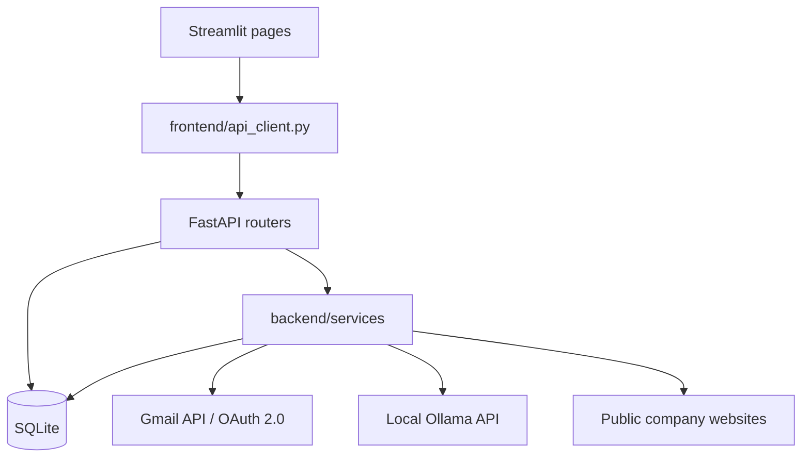

# Architecture

Job Outreach Assistant yerel, tek kullanıcılı bir uygulamadır. Katmanlar küçük
ve bilinçli olarak doğrudan tutulmuştur.

## Frontend

`frontend/app.py` Streamlit navigation ve backend sağlık durumunu yönetir.
`frontend/app_pages/` profil, şirketler, yeni başvuru ve başvuru takibi
ekranlarını içerir. Sayfalar SQLite'a erişmez.

## API client ve FastAPI

`frontend/api_client.py` HTTP, timeout ve kullanıcıya gösterilecek API hata
mesajlarını tek yerde toplar. FastAPI router'ları request doğrulaması, durum
kuralları ve transaction sınırlarını uygular.

## Service katmanı

`backend/services/` şu dış veya hesaplama ağırlıklı işleri kapsar:

- Gmail OAuth, gönderim, thread ve yanıt okuma
- Ollama ile CV, e-posta, yanıt ve follow-up üretimi
- Güvenli şirket sitesi importu ve araştırması
- Başvuru analitikleri

AI sonuçları doğrudan gönderim veya durum değişikliği yapmaz.

## Veritabanı

SQLite bağlantıları kısa ömürlü ve transaction-scoped'dur. Foreign key,
`busy_timeout`, WAL ve rollback davranışı merkezi connection helper üzerinden
uygulanır. Durum geçmişi append-only tutulur; eski kayıtların migration'ı
kanıtlanamayan geçişleri uydurmaz.

## Test sınırları

Testler izole geçici SQLite veritabanları kullanır. Gmail, Ollama ve dış web
siteleri mock edilir. Böylece test paketi gerçek e-posta, Gmail okuması veya
internet taraması yapmadan çalışabilir.
